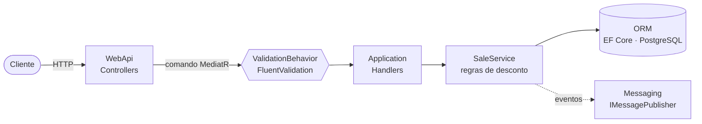

<div align="center">

# 🛒 DeveloperStore · API de Vendas

**API com CRUD completo de registros de vendas, construída com DDD, CQRS e o padrão External Identities.**


[Início rápido](#-início-rápido) •
[Regras de negócio](#-regras-de-negócio) •
[API](#-api) •
[Arquitetura](#%EF%B8%8F-arquitetura) •
[Testes](#-testes) •
[Roadmap](#%EF%B8%8F-roadmap)

</div>

---

## 📌 Sobre

Protótipo da API de vendas da **DeveloperStore**, desenvolvido para o desafio técnico da Ambev. O enunciado original do desafio está na pasta [`.doc/`](../../.doc/overview.md) na raiz do repositório. O código fica em `template/backend`.

A API registra vendas com:

- 🧾 número e data da venda
- 👤 cliente e 🏬 filial
- 📦 produtos, quantidades, preços unitários, descontos e total por item
- 💰 valor total da venda
- ❌ status de cancelada / não cancelada

### 🔗 External Identities

Cliente, Filial e Produto pertencem a **outros bounded contexts**. O contexto de Vendas nunca faz join com eles. Ele guarda o **id externo** junto com uma **descrição denormalizada**, capturada no momento da venda:

```text
Sale ──┬── CustomerId + CustomerName
       ├── BranchId   + BranchName
       └── Items[] ── ProductId + ProductName
```

---

## 🚀 Início rápido

> **Pré-requisitos:** [Docker](https://www.docker.com/) e, para rodar a API localmente ou executar os testes, o [.NET 8 SDK](https://dotnet.microsoft.com/download/dotnet/8.0).

### 🐳 Opção 1: tudo com Docker (recomendado)

```bash
git clone https://github.com/rodrigoBrandaoDeSouza/backend-challenge.git
cd backend-challenge/template/backend
docker compose up --build
```

| Serviço | Endereço |
|---|---|
| 📖 Swagger | **http://localhost:8080/swagger** |
| 🐘 PostgreSQL | `localhost:5432` (banco `developer_evaluation`, usuário `developer`) |

✅ As migrations do banco são aplicadas automaticamente quando a API sobe.

### 💻 Opção 2: banco no Docker, API na sua máquina

```bash
docker compose up -d ambev.developerevaluation.database
dotnet run --project src/Ambev.DeveloperEvaluation.WebApi --launch-profile https
```

➡️ Swagger em **https://localhost:7181/swagger** (ou `http://localhost:5119/swagger` com o profile `http`).

<details>
<summary>⚙️ Configuração e migrations manuais</summary>

A connection string fica em `src/Ambev.DeveloperEvaluation.WebApi/appsettings.json`:

```json
"DefaultConnection": "Host=localhost;Port=5432;Database=developer_evaluation;Username=developer;Password=ev@luAt10n;Pooling=true;SSL Mode=Disable;Trust Server Certificate=true"
```

No Docker, ela é sobrescrita pela variável de ambiente `ConnectionStrings__DefaultConnection` (veja o `docker-compose.yml`).

Para aplicar as migrations manualmente:

```bash
dotnet tool install --global dotnet-ef
dotnet ef database update \
  --project src/Ambev.DeveloperEvaluation.ORM \
  --startup-project src/Ambev.DeveloperEvaluation.WebApi
```

</details>

---

## 📐 Regras de negócio

O desconto é calculado por **item idêntico**: linhas com o mesmo `productId`, somando as quantidades.

| Itens idênticos | Desconto | Observação |
|:---:|:---:|:---|
| 1 – 3 | **0%** | compras com menos de 4 itens não têm desconto |
| 4 – 9 | **10%** | |
| 10 – 20 | **20%** | |
| > 20 | 🚫 | não permitido, a API retorna erro de validação |

```text
item.totalPrice  = quantity × unitPrice × (1 − desconto)
sale.totalAmount = Σ item.totalPrice
```

> 💡 Os totais enviados pelo cliente são ignorados. A API sempre recalcula.

---

## 📡 API

Rota base: **`/api/sale`**

| Método | Rota | Descrição |
|:---:|---|---|
|  | `/api/sale` | Cria uma venda |
|  | `/api/sale/{id}` | Busca uma venda pelo id |
|  | `/api/sale/Fetch?page=1&pageSize=10` | Lista as vendas paginadas, das mais recentes para as mais antigas |
|  | `/api/sale/{id}` | Atualiza uma venda |
|  | `/api/sale/{id}` | Exclui uma venda |

### ✍️ Exemplo: criar uma venda

```http
POST /api/sale
Content-Type: application/json

{
  "saleNumber": "S-0001",
  "date": "2025-10-20T14:30:00Z",
  "customerId": "6f1c2a4e-0000-4000-8000-000000000001",
  "customerName": "Bar do Zé",
  "branchId": "6f1c2a4e-0000-4000-8000-0000000000b1",
  "branchName": "Filial Toledo",
  "items": [
    { "productId": "6f1c2a4e-0000-4000-8000-0000000000a1", "productName": "Cerveja 600ml",   "quantity": 12, "unitPrice": 9.90 },
    { "productId": "6f1c2a4e-0000-4000-8000-0000000000a2", "productName": "Refrigerante 2L", "quantity": 2,  "unitPrice": 11.50 }
  ]
}
```

Resultado:

| Produto | Qtd | Preço unitário | Desconto | Total do item |
|---|:---:|---:|:---:|---:|
| Cerveja 600ml | 12 | 9,90 | 20% | **95,04** |
| Refrigerante 2L | 2 | 11,50 | 0% | **23,00** |
| | | | **Total da venda** | **118,04** |

### 🔄 Como funciona a atualização

- `date` não informada → mantém a data original da venda
- item **com** `id` → é atualizado
- item **sem** `id` → é adicionado
- item existente que não veio no payload → é removido

📂 Há mais requisições prontas no arquivo [`Ambev.DeveloperEvaluation.WebApi.http`](src/Ambev.DeveloperEvaluation.WebApi/Ambev.DeveloperEvaluation.WebApi.http), que funciona no Visual Studio e no REST Client do VS Code.

### 📣 Eventos de domínio

Os eventos são publicados via `IMessagePublisher`. Não é preciso um message broker: a implementação atual registra os eventos no log da aplicação.

| Evento | Publicado quando |
|---|---|
| `SaleCreatedEvent` | uma venda é criada |
| `SaleUpdatedEvent` | uma venda é alterada |
| `SaleDeletedEvent` | uma venda é excluída |

---

## 🏛️ Arquitetura



| Camada | Responsabilidade |
|---|---|
| **WebApi** | Controllers, requests, profiles do AutoMapper, middleware, `Program` |
| **Application** | Commands/handlers (CQRS), validadores, `SaleService` com as regras de negócio |
| **Domain** | Entidades `Sale` e `SaleItem`, contratos de repositório e serviço |
| **ORM** | `DefaultContext`, mapeamentos, migrations, `SaleRepository` |
| **Messaging** | Eventos de domínio e publisher |
| **IoC** | Módulos de injeção de dependência |
| **Common** | Pipeline de validação e logging (Serilog) |

<details>
<summary>📁 Estrutura de pastas</summary>

```text
template/backend
├── src/
│   ├── Ambev.DeveloperEvaluation.WebApi
│   ├── Ambev.DeveloperEvaluation.Application
│   ├── Ambev.DeveloperEvaluation.Domain
│   ├── Ambev.DeveloperEvaluation.ORM
│   ├── Ambev.DeveloperEvaluation.Messaging
│   ├── Ambev.DeveloperEvaluation.IoC
│   └── Ambev.DeveloperEvaluation.Common
├── tests/
│   ├── Ambev.DeveloperEvaluation.Unit
│   ├── Ambev.DeveloperEvaluation.Integration
│   └── Ambev.DeveloperEvaluation.Functional
├── docker-compose.yml
├── Dockerfile
└── Ambev.DeveloperEvaluation.sln
```

</details>

### 🧰 Tecnologias

| Área | Tecnologias |
|---|---|
| **Runtime** | .NET 8 · ASP.NET Core Web API · Swagger |
| **Dados** | EF Core 8 · Npgsql · PostgreSQL 13 |
| **Padrões** | DDD · CQRS com MediatR · External Identities · Repository |
| **Bibliotecas** | AutoMapper · FluentValidation · Serilog |
| **Testes** | xUnit · Moq · NSubstitute · Bogus · Coverlet |
| **Infra** | Docker · Docker Compose |

---

## 🧪 Testes

```bash
dotnet test Ambev.DeveloperEvaluation.sln
```

📊 Relatório de cobertura, gerado em `TestResults/CoverageReport/index.html`:

```bash
./coverage-report.sh     # Linux / macOS
coverage-report.bat      # Windows
```

Os testes unitários cobrem:

- ✅ faixas de desconto e o limite de 20 itens
- ✅ validadores dos commands (create, update, get, fetch, delete)
- ✅ handlers e o `SaleService`
- ✅ definição da data da venda e External Identities
- ✅ publicação de eventos

---

## 🗺️ Roadmap

- [ ] Endpoints para cancelar a venda e um item específico, publicando `SaleCancelled` e `ItemCancelled`
- [ ] Desconsiderar itens cancelados nos totais e descontos
- [ ] DTOs de resposta em vez de expor as entidades de domínio; `404` no `GET /api/sale/{id}`
- [ ] Testes de integração e funcionais com Testcontainers e `WebApplicationFactory`
- [ ] CI com GitHub Actions (build + testes)

---

<div align="center">

Desenvolvido por **Rodrigo Brandão** · 📍 Toledo, PR

[](https://www.linkedin.com/in/brandao-rodrigo/)

</div>
